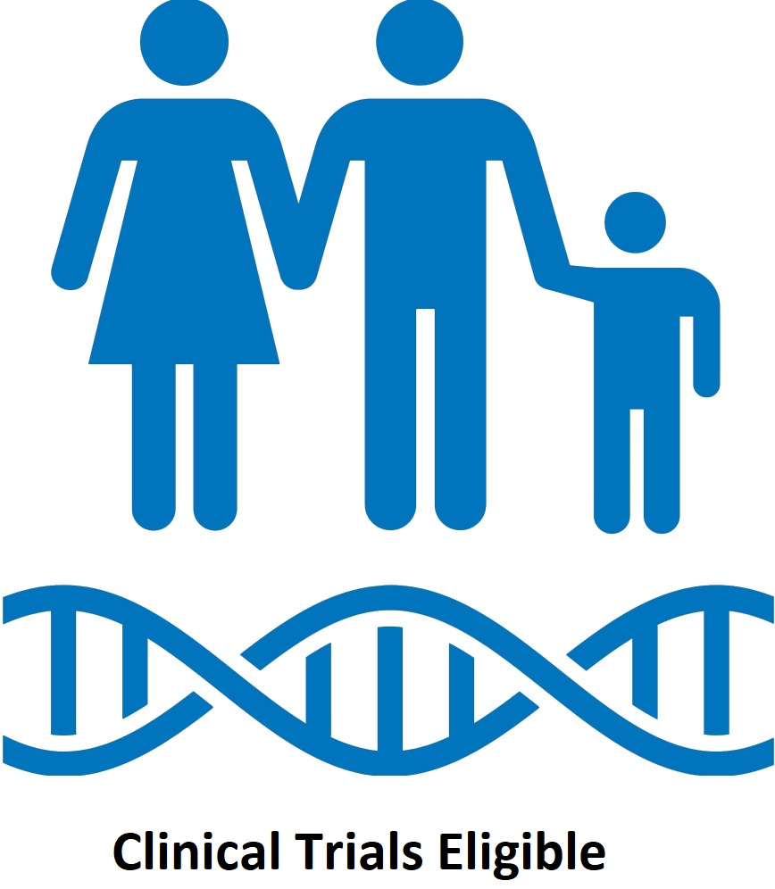
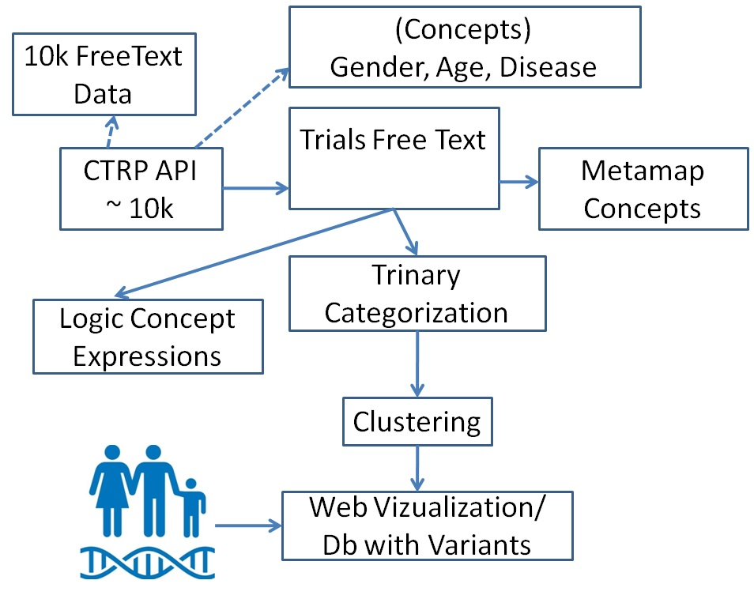
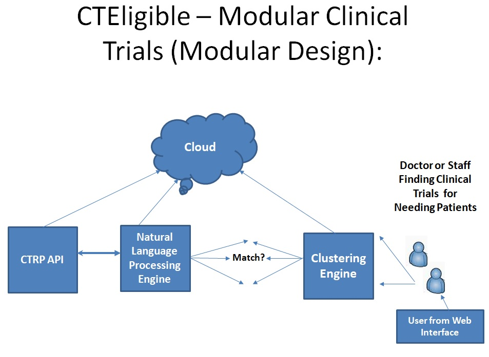

# CTEligible
A Tool for Automating Similar Eligibility Protocol Criteria for Clinical Trials Using Machine Learning.

 
# What's the project background?
Less than 5% of patients eligible for clinical trials register, resulting in higher drug development costs, drugs based on limited/overrepresented populations, and longer wait times. Making clinical trial search more effective can potentially decrease barriers to enrollment.
The writing of clinical trial protocols -- the registration information describing a trial, its goals, the plan for carrying out the study, and who is eligible – historically has been written as free text independently for each trial. As a result, this text is not easily read by a computer. Searching across trials or linking data (like linking patients to eligible trials, or trials to eligible patients) becomes extremely problematic and error prone.
One can make clinical trial searching and matching more successful by helping machines better understand the information that describes who is eligible for a clinical trial.

The goal of this project is to use machine learning techniques to find patterns of similar eligibility protocol criteria for clinical trials and guide the development of data-base clinical trial protocols for patient-to-trial matching.

 # CTEligible Workflow
 
 
  # CTEligible Modular Workflow
 
